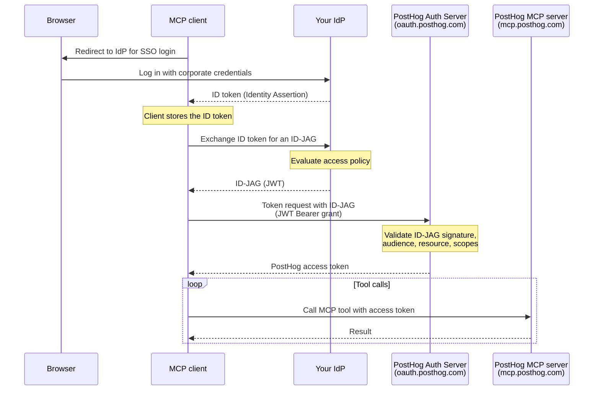

import { CalloutBox } from 'components/Docs/CalloutBox'

The PostHog MCP server supports the [Model Context Protocol Enterprise-Managed Authorization extension](https://modelcontextprotocol.io/extensions/auth/enterprise-managed-authorization). This lets your organization's identity provider (IdP) — like Okta, Microsoft Entra ID, or any OIDC-compliant SSO — control who can connect to the PostHog MCP server, without each employee individually OAuthing to PostHog or managing a [personal API key](/docs/model-context-protocol/faq#using-an-api-key-instead-of-oauth).

It's built on **ID-JAG** (Identity Assertion JWT Authorization Grant, also called [XAA](https://xaa.dev)) — an OAuth grant profile where your IdP issues a short-lived JWT that the MCP client exchanges with PostHog for an access token. Access is granted, scoped, and revoked centrally in your IdP.

<CalloutBox icon="IconInfo" title="Enterprise-managed authorization is in beta" type="fyi">

ID-JAG/XAA is currently in `beta`. This means the flow and configuration are subject to change, and the underlying MCP extension and ID-JAG specs are still evolving. [Get in touch](/talk-to-a-human) if you'd like to try it.

</CalloutBox>

<CalloutBox icon="IconStar" title="Enterprise plan only" type="action">

Enterprise-managed authorization is only available on the Enterprise plan. See [pricing](/pricing) for details or [talk to us](/talk-to-a-human) to upgrade.

</CalloutBox>

> **Who is this for?** Enterprise teams that already manage app access through an IdP and want MCP access to follow the same policies. If you're an individual user, the standard [OAuth flow](/docs/model-context-protocol) is simpler and works out of the box.

## How it works

Instead of redirecting the user to PostHog to authorize, the MCP client asks your IdP for an ID-JAG and exchanges it for a PostHog access token. Your IdP evaluates its own access policies (group membership, conditional access, etc.) before issuing the ID-JAG, so authorization decisions stay in one place.



The key difference from standard MCP OAuth: **the client never sends the user to PostHog's authorization page**. Your IdP is the authority, and PostHog only validates the assertion it produced.

### Discovery

Spec-compliant MCP clients discover that PostHog supports this flow via the `authorization_grant_profiles_supported` field in PostHog's OAuth metadata, served at:

- `https://oauth.posthog.com/.well-known/oauth-authorization-server` (RFC 8414)
- `https://oauth.posthog.com/.well-known/openid-configuration` (OIDC discovery)

Both advertise the ID-JAG grant profile:

```json
{
  "authorization_grant_profiles_supported": [
    "urn:ietf:params:oauth:grant-profile:id-jag"
  ],
  "grant_types_supported": [
    "authorization_code",
    "refresh_token",
    "urn:ietf:params:oauth:grant-type:jwt-bearer"
  ]
}
```

The client derives the ID-JAG `aud` claim from the authorization server issuer (`https://oauth.posthog.com`) and the `resource` claim from the MCP server identifier (`https://mcp.posthog.com/mcp`).

## Requirements

- An **enterprise plan with the XAA authentication feature** enabled on your PostHog organization. If you're not sure whether your plan includes it, [contact us](/talk-to-a-human).
- A **verified domain** in PostHog for the email domain your users sign in with.
- An **IdP that can issue ID-JAG tokens** (the OAuth Identity Assertion Authorization Grant). Your IdP must publish an OIDC discovery document (or JWKS endpoint) that PostHog can reach.
- An **MCP client that supports the enterprise-managed authorization extension**. Support is opt-in and varies by client — check the [MCP client matrix](https://modelcontextprotocol.io/extensions/client-matrix).

## Setup

### 1. Verify your domain in PostHog

In PostHog, go to [**Organization settings → Authentication domains & SSO**](https://app.posthog.com/settings/organization-authentication) and add and verify the domain your users authenticate with (e.g. `example.com`). See the [SSO docs](/docs/settings/sso) for domain verification steps.

ID-JAG only accepts tokens for users who are **active members of the organization that owns the verified domain**, so the user's email domain must match.

### 2. Configure the trusted IdP

On the verified domain, open the **Configure XAA (ID-JAG)** modal and fill in:

| Field | Required | Description |
| --- | --- | --- |
| **IdP issuer URL** | Yes | Your IdP's issuer URL. Must exactly match the `iss` claim on the ID-JAG tokens it issues (e.g. `https://idp.example.com`). Setting this enables ID-JAG for the domain. |
| **JWKS URL** | No | Override the key set location. Defaults to OIDC discovery at `{issuer}/.well-known/openid-configuration`. |
| **Allowed client IDs** | No | Restrict which OAuth `client_id` values are accepted. Leave empty to allow any client. |

PostHog uses the issuer URL to fetch your IdP's public keys and verify every ID-JAG signature. Internal, loopback, and metadata-host URLs are rejected.

### 3. Grant the required scopes in your IdP

Configure your IdP to include these scopes when it issues ID-JAGs, at minimum:

- `user:read` — required for all MCP connections
- `organization:read` and `project:read` — required for the MCP server to bootstrap (list your orgs and projects)
- Any additional scopes for the tools you want to use (for example, `feature_flag:write` to manage flags)

PostHog issues the access token with the **intersection** of the scopes your IdP granted and the scopes the client requested. Tokens missing the bootstrap scopes are rejected at the MCP server with an `insufficient_scope` error.

### 4. Point your MCP client at PostHog

Configure your MCP client (per your IT/admin's instructions for that client) to:

- Use the server URL `https://mcp.posthog.com/mcp`
- Declare the extension in its `initialize` request:

  ```json
  {
    "capabilities": {
      "extensions": {
        "io.modelcontextprotocol/enterprise-managed-authorization": {}
      }
    }
  }
  ```

- Authenticate users via your enterprise IdP and use the resulting ID token to request ID-JAGs.

The client handles the ID-JAG exchange automatically — your users sign in with their normal corporate SSO and never see a PostHog authorization prompt.

## Tokens

The access token PostHog mints from a valid ID-JAG is:

- **Short-lived** — 2 hours by default. The client repeats the ID-JAG exchange to get a fresh token; there's no refresh token.
- **Audience-restricted** — bound to the MCP resource (`aud` = `https://mcp.posthog.com/mcp`), so it can't be replayed against other PostHog APIs.
- **Organization-scoped** — bound to the organization that owns the verified domain and the IdP config.
- **Single-use per assertion** — each ID-JAG's `jti` is recorded, so a captured ID-JAG can't be replayed.

## Revoking access

Because authorization lives in your IdP, **revoking a user's access there takes effect immediately** — once your IdP stops issuing ID-JAGs for a user (or for the PostHog resource), the client can no longer obtain new access tokens. Existing access tokens expire on their own within the short token lifetime. There's nothing to revoke per-client or per-device in PostHog.

## Troubleshooting

The token endpoint returns standard OAuth errors ([RFC 6749 §5.2](https://www.rfc-editor.org/rfc/rfc6749#section-5.2)). Common ones:

| Error | What it means |
| --- | --- |
| `access_denied` | The organization doesn't have the XAA authentication feature enabled. |
| `invalid_grant` (`ID-JAG could not be verified`) | No verified domain matches the token's email/issuer, the issuer doesn't match the configured IdP, the email isn't verified, or the user isn't an active member of the organization. The message is intentionally generic — check PostHog logs and your IdP config. |
| `invalid_grant` (`ID-JAG has expired` / `not yet valid`) | Clock skew between your IdP and PostHog (tolerance is 30 seconds by default), or an expired assertion. |
| `invalid_target` | The token's `resource` claim doesn't match the MCP server. Confirm the client derived the resource from PostHog's discovery metadata. |
| `invalid_client` | The token's `client_id` isn't in the domain's allowed client IDs list. |
| `insufficient_scope` (from the MCP server) | The granted scopes are missing `user:read`, `organization:read`, or `project:read`. Add them in your IdP. |

## Further reading

- [ID-JAG (XAA) authentication](/docs/settings/id-jag) – the general grant, beyond MCP
- [MCP Enterprise-Managed Authorization extension](https://modelcontextprotocol.io/extensions/auth/enterprise-managed-authorization)
- [ID-JAG / XAA specification](https://xaa.dev)
- [MCP server overview](/docs/model-context-protocol)
- [MCP FAQ and advanced setup](/docs/model-context-protocol/faq)
- [SSO and authentication domains](/docs/settings/sso)
