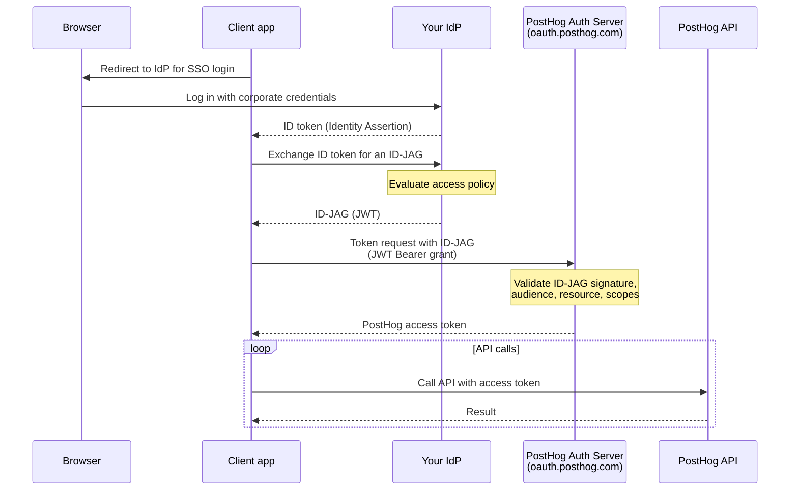

import { CalloutBox } from 'components/Docs/CalloutBox'

ID-JAG (Identity Assertion JWT Authorization Grant, also called [XAA](https://xaa.dev)) lets your organization's identity provider (IdP) — like Okta, Microsoft Entra ID, or any OIDC-compliant SSO — issue short-lived tokens that grant programmatic access to PostHog. Instead of each user creating a [personal API key](/docs/api#authentication) or running an [OAuth](/docs/api/oauth) flow, your IdP issues an **ID-JAG** that's exchanged with PostHog for a short-lived access token. Access is granted, scoped, and revoked centrally in your IdP.

<CalloutBox icon="IconFlask" title="ID-JAG/XAA is in beta" type="action">

ID-JAG/XAA is currently in `beta`. This means the flow and configuration are subject to change, and the underlying ID-JAG spec is still evolving.

</CalloutBox>

<CalloutBox icon="IconStar" title="Enterprise plan only" type="action">

ID-JAG (XAA) is only available on the Enterprise plan, and isn't enabled for every Enterprise customer yet. If you're interested, reach out to your technical account manager (TAM) or the <SmallTeam slug="platform-features" /> team to get access.

</CalloutBox>

## Why use it

ID-JAG keeps authorization decisions in your IdP instead of spreading them across personal keys and per-user OAuth grants:

- **No personal API keys to manage** — users authenticate with their existing corporate SSO, and tokens are minted on demand.
- **Centralized policy** — your IdP evaluates its own access policies (group membership, conditional access, etc.) before issuing an ID-JAG.
- **Centralized revocation** — once your IdP stops issuing ID-JAGs for a user, they can no longer obtain new access tokens. Existing tokens expire on their own within a short lifetime.
- **Scoped tokens** — the issued access token carries only the scopes your IdP granted, intersected with what the client requested.

The most common use is connecting AI agents to the [PostHog MCP server](/docs/model-context-protocol) under central control. See [enterprise-managed authorization](/docs/model-context-protocol/enterprise-managed-authorization) for the MCP-specific setup.

## How it works



PostHog validates each ID-JAG against the trusted IdP's public keys (via OIDC discovery or a JWKS URL), checks its audience, resource, issuer, and expiration, confirms the user is an active member of the organization that owns the verified domain, then mints a short-lived access token.

## Requirements

- An **Enterprise plan with the XAA authentication feature** enabled on your PostHog organization. [Contact us](/talk-to-a-human) if you're not sure whether your plan includes it.
- A **verified domain** in PostHog for the email domain your users sign in with.
- An **IdP that can issue ID-JAG tokens** and publishes an OIDC discovery document (or JWKS endpoint) that PostHog can reach.

## Setup

### 1. Verify your domain in PostHog

Go to [**Organization settings → Authentication domains & SSO**](https://app.posthog.com/settings/organization-authentication) and add and verify the domain your users authenticate with (e.g. `example.com`). See the [SSO docs](/docs/settings/sso) for domain verification steps.

ID-JAG only accepts tokens for users who are **active members of the organization that owns the verified domain**, so the user's email domain must match.

### 2. Configure the trusted IdP

On the verified domain, open the **Configure XAA (ID-JAG)** modal and fill in:

| Field | Required | Description |
| --- | --- | --- |
| **IdP issuer URL** | Yes | Your IdP's issuer URL. Must exactly match the `iss` claim on the ID-JAG tokens it issues (e.g. `https://idp.example.com`). Setting this enables ID-JAG for the domain. |
| **JWKS URL** | No | Override the key set location. Defaults to OIDC discovery at `{issuer}/.well-known/openid-configuration`. |
| **Allowed client IDs** | No | Restrict which OAuth `client_id` values are accepted. Leave empty to allow any client. |

PostHog uses the issuer URL to fetch your IdP's public keys and verify every ID-JAG signature. Internal, loopback, and metadata-host URLs are rejected.

### 3. Grant the required scopes in your IdP

Configure your IdP to include the scopes each integration needs when it issues ID-JAGs. At minimum, all tokens need `user:read`. For the [MCP server](/docs/model-context-protocol/enterprise-managed-authorization), also include `organization:read` and `project:read`. Add any additional [API scopes](/docs/api#scopes) for what you want to do (for example, `feature_flag:write` to manage flags).

PostHog issues the access token with the **intersection** of the scopes your IdP granted and the scopes the client requested.

## Exchanging an ID-JAG for an access token

Clients exchange an ID-JAG at PostHog's OAuth token endpoint using the [RFC 7523](https://www.rfc-editor.org/rfc/rfc7523) JWT Bearer grant:

- **Cloud:** `https://oauth.posthog.com/oauth/token/`
- **Self-hosted:** `{your-instance-url}/oauth/token/`

```bash
curl -X POST https://oauth.posthog.com/oauth/token/ \
  -d grant_type=urn:ietf:params:oauth:grant-type:jwt-bearer \
  -d assertion=<the ID-JAG JWT from your IdP> \
  -d scope="user:read organization:read project:read"
```

A successful response returns a short-lived access token:

```json
{
  "access_token": "...",
  "token_type": "Bearer",
  "expires_in": 7200,
  "scope": "user:read organization:read project:read"
}
```

Use it as a bearer token on PostHog API requests: `Authorization: Bearer <access_token>`.

Most enterprise MCP clients perform this exchange automatically — you usually don't call the token endpoint by hand. See [enterprise-managed authorization](/docs/model-context-protocol/enterprise-managed-authorization) for the MCP flow.

## Tokens

The access token PostHog mints from a valid ID-JAG is:

- **Short-lived** — 2 hours by default. The client repeats the ID-JAG exchange to get a fresh token; there's no refresh token.
- **Audience-restricted** — bound to the resource the ID-JAG targeted, so it can't be replayed against other audiences.
- **Organization-scoped** — bound to the organization that owns the verified domain and the IdP config.
- **Single-use per assertion** — each ID-JAG's `jti` is recorded, so a captured ID-JAG can't be replayed.

## Revoking access

Because authorization lives in your IdP, **revoking a user's access there takes effect immediately** — once your IdP stops issuing ID-JAGs for a user, the client can no longer obtain new access tokens, and existing tokens expire within the short token lifetime. There's nothing to revoke per-client or per-device in PostHog.

## Troubleshooting

The token endpoint returns standard OAuth errors ([RFC 6749 §5.2](https://www.rfc-editor.org/rfc/rfc6749#section-5.2)). Common ones:

| Error | What it means |
| --- | --- |
| `access_denied` | The organization doesn't have the XAA authentication feature enabled. |
| `invalid_grant` (`ID-JAG could not be verified`) | No verified domain matches the token's email/issuer, the issuer doesn't match the configured IdP, the email isn't verified, or the user isn't an active member of the organization. The message is intentionally generic — check PostHog logs and your IdP config. |
| `invalid_grant` (`ID-JAG has expired` / `not yet valid`) | Clock skew between your IdP and PostHog (tolerance is 30 seconds by default), or an expired assertion. |
| `invalid_target` | The token's `resource` claim doesn't match an allowed resource. Confirm the client derived the resource from PostHog's discovery metadata. |
| `invalid_client` | The token's `client_id` isn't in the domain's allowed client IDs list. |
| `insufficient_scope` (from the resource server) | The granted scopes don't cover what the request needs. Add the missing scopes in your IdP. |

## Further reading

- [Enterprise-managed authorization for MCP](/docs/model-context-protocol/enterprise-managed-authorization)
- [ID-JAG / XAA specification](https://xaa.dev)
- [SSO, SAML, & SCIM](/docs/settings/sso)
- [OAuth integration](/docs/api/oauth)
- [API authentication and scopes](/docs/api#authentication)
